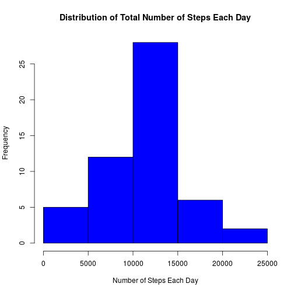
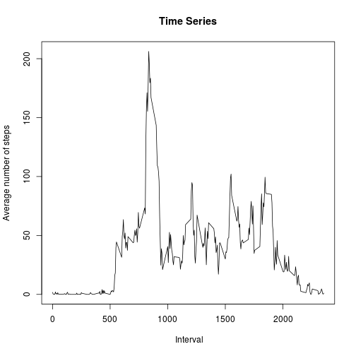
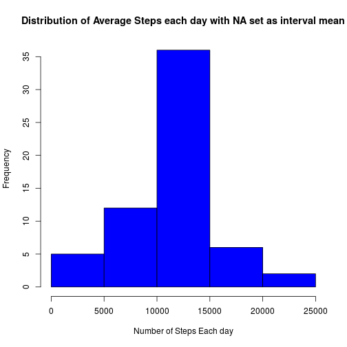

Initializing:


```r
figure.keep = 'all'
activity <- read.csv("activity.csv")
```

Loading libraries : 'dplyr', 'lubridate', 'lattice',


```r
library("dplyr")
library("lubridate")
library("lattice")
```

Loading data frame in dplyr, to make it easier to read. Also changing the date format so it can be easily accessed and manipulated to get days of the week etc.

In addition, rows with NA can be dropped for the initial analysis.


```r
activity_df1 <- tbl_df(activity)
activity_df <- mutate(activity_df1, forymd = ymd(date))
nona_steps <- !is.na(activity_df$steps)
```
##Part 1.
In order to make the histogram of daily activity, we first need to calculate the number of steps per day. This is also useful for calculating the mean and median of daily activity.


```r
activity_perday <- aggregate(activity_df$steps[nona_steps], list(activity_df$forymd[nona_steps]), sum)
```
The histogram for daily activity is shown below:

 


```r
summary(activity_perday)
```

```
##     Group.1                          x        
##  Min.   :2012-10-02 00:00:00   Min.   :   41  
##  1st Qu.:2012-10-16 00:00:00   1st Qu.: 8841  
##  Median :2012-10-29 00:00:00   Median :10765  
##  Mean   :2012-10-30 17:12:27   Mean   :10766  
##  3rd Qu.:2012-11-16 00:00:00   3rd Qu.:13294  
##  Max.   :2012-11-29 00:00:00   Max.   :21194
```
So the **Mean** number of steps taken per day is 10766, while the **Median** is 10765

##Part 2.

In order to make the time series plot, we need to average across intervals. 


```r
activity_perinterval <- aggregate(activity_df$steps[nona_steps], list(activity_df$interval[nona_steps]), mean)
```
Plotting the activity per interval:

 

Calculating interval with highest activity:


```r
maxrow <- which(activity_perinterval$x == max(activity_perinterval$x))

summary(activity_perinterval)
```

```
##     Group.1             x          
##  Min.   :   0.0   Min.   :  0.000  
##  1st Qu.: 588.8   1st Qu.:  2.486  
##  Median :1177.5   Median : 34.113  
##  Mean   :1177.5   Mean   : 37.383  
##  3rd Qu.:1766.2   3rd Qu.: 52.835  
##  Max.   :2355.0   Max.   :206.170
```
The maximum activity occurs during interval 205-210

## Part 3.

The assignment asks to replace the missing data with reasonable values. Mean or median for the day or interval can be chosen. I am choosing mean for the interval for two reasons. 

1. The interval is more finely grained.
2. Some of the days have no data.


```r
length(activity_perday$x)
```

```
## [1] 53
```

```r
length(unique(activity_df$forymd))
```

```
## [1] 61
```

Adding a column to store numeric code for missing data


```r
activity_dfmissing <- mutate(activity_df, missing = as.numeric(is.na(activity_df$steps)))
                             
sum(activity_dfmissing$missing)
```

```
## [1] 2304
```

Modifying column names to facilitate "merge", the average number of steps per iterval is propagated through the last column.


```r
colnames(activity_perinterval) <- c("interval", "averageperinterval")
dfmissing <- merge(activity_dfmissing, activity_perinterval, by = "interval")
```
Duplicating the column with steps and generating list of rownames where steps is NA:


```r
dfmissing_replaced <- mutate(dfmissing, replaced = steps)

rowname <- c(which(is.na(dfmissing_replaced$steps)))
```
Replacing NA values in duplicate column with the average for the corresponding interval:

```r
missing_replaced <- replace(dfmissing_replaced$replaced, rowname, dfmissing_replaced$averageperinterval[rowname])

dfmissing_replaced <- mutate(dfmissing_replaced, missing_replaced)

dfmissing_replaced <- arrange(dfmissing_replaced, forymd, interval)                             
```
Generating table similar to the input table:


```r
activitymissing_replaced <- select(dfmissing_replaced, missing_replaced, date, interval, -forymd, -steps, -averageperinterval, -replaced )

head(activitymissing_replaced)
```

```
##   missing_replaced       date interval
## 1        1.7169811 2012-10-01        0
## 2        0.3396226 2012-10-01        5
## 3        0.1320755 2012-10-01       10
## 4        0.1509434 2012-10-01       15
## 5        0.0754717 2012-10-01       20
## 6        2.0943396 2012-10-01       25
```

```r
head(activity_df1)
```

```
## Source: local data frame [6 x 3]
## 
##   steps       date interval
## 1    NA 2012-10-01        0
## 2    NA 2012-10-01        5
## 3    NA 2012-10-01       10
## 4    NA 2012-10-01       15
## 5    NA 2012-10-01       20
## 6    NA 2012-10-01       25
```
To generate the histogram per interval, we need to aggregate the data usign interval


```r
activityreplaced_perday <- aggregate(dfmissing_replaced$missing_replaced, list(dfmissing_replaced$forymd), sum)

summary(activityreplaced_perday)
```

```
##     Group.1                 x        
##  Min.   :2012-10-01   Min.   :   41  
##  1st Qu.:2012-10-16   1st Qu.: 9819  
##  Median :2012-10-31   Median :10766  
##  Mean   :2012-10-31   Mean   :10766  
##  3rd Qu.:2012-11-15   3rd Qu.:12811  
##  Max.   :2012-11-30   Max.   :21194
```

So the **Mean** and **Median** are both equal, 10766.

The plot of the resulting distribution is:

 

## Part4.

We need to add labels "Weekend" and "Weekday" to the data table. 


```r
activity_dfwday <- mutate(activity_df, weekday = wday(activity_df$forymd))

head(activity_dfwday)
```

```
## Source: local data frame [6 x 5]
## 
##   steps       date interval     forymd weekday
## 1    NA 2012-10-01        0 2012-10-01       2
## 2    NA 2012-10-01        5 2012-10-01       2
## 3    NA 2012-10-01       10 2012-10-01       2
## 4    NA 2012-10-01       15 2012-10-01       2
## 5    NA 2012-10-01       20 2012-10-01       2
## 6    NA 2012-10-01       25 2012-10-01       2
```

The weekday column contains numbers 1 to 7, where 1 stands for Sunday. Using this to classify the weekend:


```r
activity_dfwday <- mutate(activity_dfwday, endorno = is.element(activity_dfwday$weekday, c(2,3,4,5,6)))

activity_dfwday$classifyweekday <- factor(activity_dfwday$endorno, labels = c("weekend", "weekday"))

head(activity_dfwday)
```

```
## Source: local data frame [6 x 7]
## 
##   steps       date interval     forymd weekday endorno classifyweekday
## 1    NA 2012-10-01        0 2012-10-01       2    TRUE         weekday
## 2    NA 2012-10-01        5 2012-10-01       2    TRUE         weekday
## 3    NA 2012-10-01       10 2012-10-01       2    TRUE         weekday
## 4    NA 2012-10-01       15 2012-10-01       2    TRUE         weekday
## 5    NA 2012-10-01       20 2012-10-01       2    TRUE         weekday
## 6    NA 2012-10-01       25 2012-10-01       2    TRUE         weekday
```

Aggregating data:


```r
weekday_weekend <- aggregate(activity_dfwday$steps[nona_steps], list(activity_dfwday$interval[nona_steps], activity_dfwday$classifyweekday[nona_steps]), mean)
```
 


```
